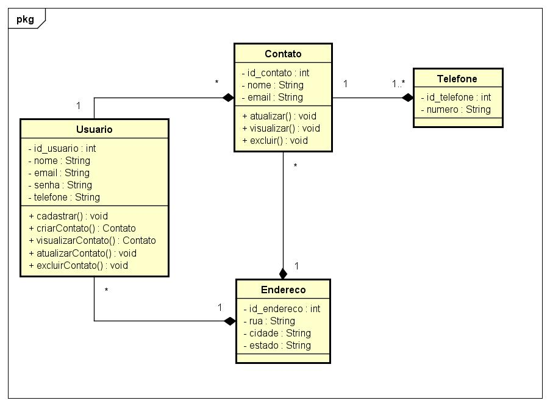

# agendaWeb
# Sistema de Agenda Online

Este projeto implementa um sistema de agenda online desenvolvido com o framework **Spring Web MVC**, **Thymeleaf** e **Banco de Dados**. O sistema permite que os usuários se cadastrem, se loguem e gerenciem suas agendas de contatos de forma simples e eficiente.

## Funcionalidades

1. **Cadastro de Usuário:** O usuário pode criar uma conta no sistema.
2. **Login:** O usuário pode acessar o sistema com seu login e senha.
3. **Alteração de Senha e Perfil:** Uma vez logado, o usuário pode alterar sua senha e atualizar suas informações de perfil.
4. **Cadastro de Contatos:** O usuário pode cadastrar múltiplos contatos em sua agenda. Cada contato possui os seguintes campos obrigatórios:
   - Nome
   - Endereço
   - E-mail
   - Múltiplos números de telefone
5. **Visualização de Contatos:** O usuário pode visualizar todos os contatos que ele cadastrou. O sistema é projetado para garantir que cada usuário só tenha acesso aos seus próprios contatos.
6. **Pesquisa de Contatos:** O usuário pode pesquisar por nome de contato. O sistema realiza a busca de forma eficiente, retornando todos os contatos que correspondem à pesquisa, mesmo que a pesquisa seja parcial.

## Tecnologias Utilizadas

- **Spring Web MVC**: Framework para desenvolvimento de aplicações web.
- **Thymeleaf**: Motor de templates para a renderização de páginas HTML.
- **Banco de Dados Relacional - Postgresql**: Para armazenar as informações do usuário e seus contatos.

## Diagrama de Caso de Uso

O diagrama de caso de uso ilustra as interações principais do sistema com os usuários. Ele descreve como o usuário interage com o sistema para realizar ações como se cadastrar, logar, adicionar contatos e buscar contatos.

